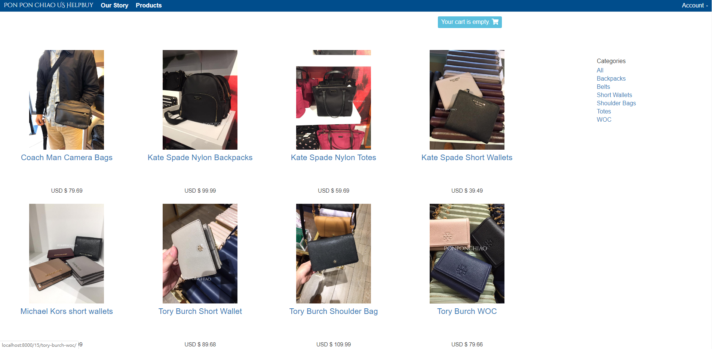
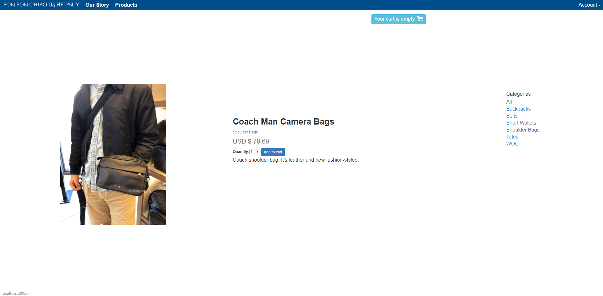
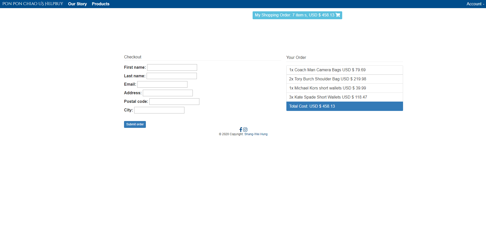
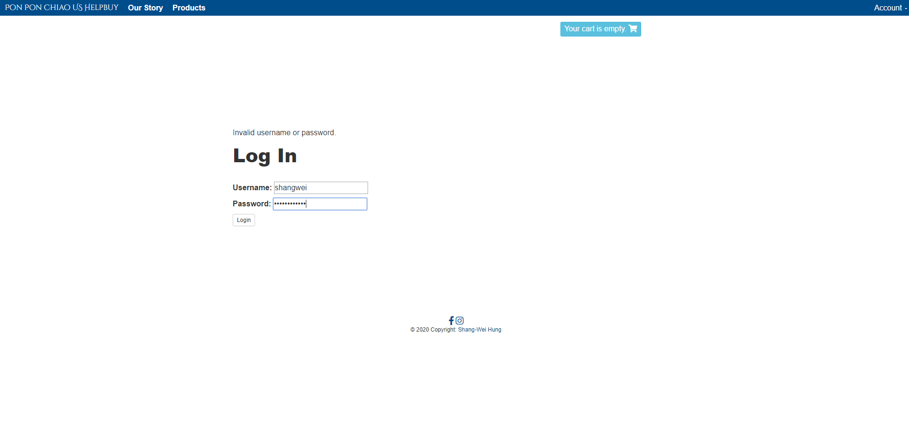
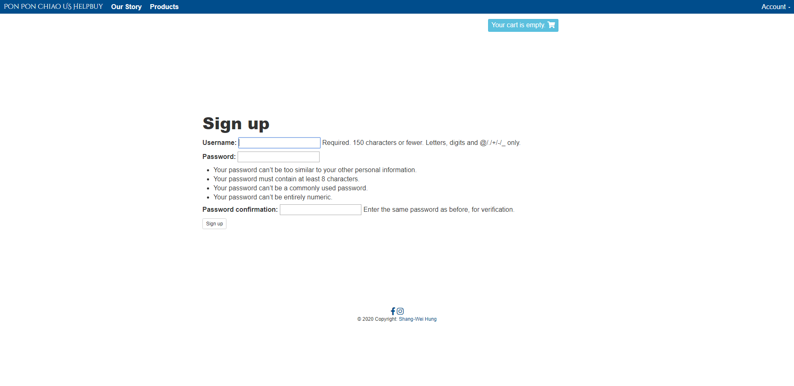

# eCommerce Website
I am the beginner for Django. This website is my first practice.
It's ecommerce website built with Django 3.0.3 with style by bootstrap.
The case is my sideline - 'PonPonChiao HelpBuy Company'. I'll keep adding some new functions into it.

# Demo
### Home Page

### Product Detail View

### Shopping Cart

### Checkout Page

### Order Confirmation Page

### LogIn Page

### Register Page


# Built with
1. Django
2. Python
3. HTML
4. CSS
5. Bootstrap
6. SQLite database

# Functions
1. Product List Page
2. Product Detail Page
3. Order Page
4. Checkout Page
5. Log In/ Sign Up Page
6. __*(Under development) Email Confirmation Service*__
7. __*(Under development)  Multi-image Per Products*__


## File Structure
only list important files
```
Root
|
|
+----eCommerce
|   | settings.py                                         register app
|
+----cart
|   |
|   +----templates/cart/detail.html                       shopping cart page
|   | cart.py
|   | forms.py               
|   | urls.py
|   | views.py   
|
+----orders
|   |
|   +----templates/orders/order
|   |                      | create.html                  order checkout page
|   |                      | created.html                 order confirmation page
|   | admin.py   
|   | forms.py               
|   | models.py                                           success transcation data
|   | urls.py
|   | views.py 
|
+----shop
|   |
|   |
|   +----static
|   |      |
|   |      +----css                                       customed css files folder
|   |      |
|   |      +----img                                       static image folder
|   |      |
|   |      +----js                                        js file folder
|   |
|   +----templates/shpo
|   |              | 
|   |              +----product
|   |              |      | detail.html                   product detail view
|   |              |      | list.html                     home page
|   |              |      
|   |              | base.html                            base timeplate
|   |              | footer.html
|   |              | navbar.html
|   |              | login.html                           log in page
|   |              | signup.html                          register page
|   |              
|   | admin.py   
|   | forms.py               
|   | models.py                                           product data and category data
|   | urls.py
|   | views.py 

```
